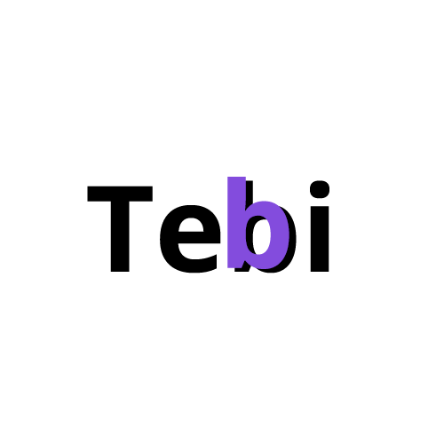

<p align="center">
   
   <h2 align="center">Teman Bicara</h2>
</p>

<p align="center">
    <a href="https://github.com/Teman-Bicara/teman-bicara/issues"></a>
    <a href="https://github.com/Teman-Bicara/teman-bicara"></a>
    <a href="https://github.com/Teman-Bicara/teman-bicara/pulls"></a>
</p>


## Teman Bicara

Teman Bicara merupakan sebuah platform atau forum untuk tempat berbagi permasalahan kesehatan mental pada remaja berbasis web. Dan forum teman berbicara dapat diakses dimanapun selama ada akses internet.

## Tech Stack

Ini adalah beberapa core stack yang digunakan untuk membangun project saat ini: 
- React (using create-react-app)
- TailwindCSS (for styling and UI)
- Strapi (cms headless for database store and auth)


## Run Locally

Clone the project

```bash
  git clone https://github.com/Teman-Bicara/teman-bicara
```

Go to the project directory

```bash
  cd teman-bicara
```

Install dependencies

```bash
  npm install
```

Start the server

```bash
  npm run start
```

## User Guide

1. Melakukan pendaftaran pada halaman web Tebi yang dapat diakses melalui https://teman-bicara.netlify.app/ .

> Pastikan ketika ingin mendaftar jangan gunakan nama asli Anda guna menjaga privasi dan terhindar dari cyber bullying.

2. Jika sudah berhasil mendaftar akan langsung diarahkan pada halaman untuk melakukan login. Masukkan email atau username dan password yang sudah didaftarkan.

3. Kemudian jika sudah berhasil masuk pada beranda aplikasi akan langsung terlihat beberapa postingan yang pengguna lain buat.

<p align="center">
   
</p>

4. Jika ingin membuat sebuah postingan pengguna bisa meng-klik menu `Write` dan akan diarahkan ke halaman untuk membuat postingan.

<p align="center">
   
</p>

5. Dan terakir untuk keluar dari aplikasi pengguna bisa meng-klik menu `Logout` dan kemudian akan kembali ke halaman awal Landing Page.

## Security Vulnerabilities

Jika Anda menemukan sebuah kerentanan keamanan dalam project ini, silahkan buka issue. Dan semua kerentanan akan coba kami segera tangani.

## Feedback

Jika Anda memiliki umpan balik, silakan hubungi kami di tebicara@gmail.com

## All Contributors

Berikut adalah beberapa orang yang terlibat dalam pembuatan project Teman Bicara. Terimakasih atas peran kontribusi yang telah menyumbangkan ide-idenya!

<a href="https://github.com/Teman-Bicara/teman-bicara/graphs/contributors"></a>

## License

[MIT](https://choosealicense.com/licenses/mit/)
